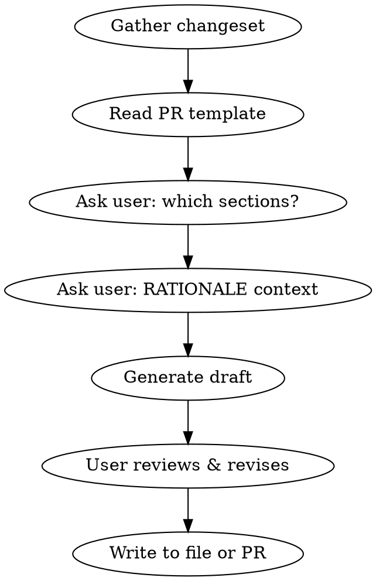

# Writing PR Description

## Overview

Generate a PR description from the current branch's changeset that conforms to the project's PR template. Ask the user what sections to include before generating, then produce a polished draft.

## Workflow

### 1. Gather the changeset

In parallel: `git log main..HEAD --oneline`, `git diff main..HEAD --stat`, `git diff main..HEAD`. Read key changed files if diff is large.

### 2. Read the PR template

Read `.github/PULL_REQUEST_TEMPLATE.md` (or equivalent). The PR Automation block **MUST** be preserved verbatim.

### 3. Ask the user which sections to include

Use AskUser:

1. **Which optional sections** beyond required RATIONALE + CHANGES? Options: TESTING (recommended default), SCREENSHOTS, TODO, NOTES, RELATED, REVIEWERS.
2. **Any RATIONALE context** to include? Remind: avoid sensitive/internal company knowledge.

### 4. Generate the description

#### RATIONALE — narrative, conversational voice

1. **Problem** — what's missing/broken today ("Currently, we only...")
2. **Why it matters** — what this enables or prevents
3. **Solution approach** (1-2 sentences) — naturally ("Thankfully..." / "So let's...")

Never include proprietary/internal company knowledge. Describe the technical gap, not the business case.

#### CHANGES — bold-headed bullets with Mermaid when applicable

- Each bullet: `**Change description** (\`path/to/file.go\`)` — bold summary, parenthetical file ref
- Group related file changes under one bullet
- When changes affect **data flows, process flows, or architecture**: add `### Before` / `### After` subsections with Mermaid `flowchart LR` diagrams (node labels under ~20 chars)

Auto-include Mermaid when diff modifies data retrieval/caching, API shapes, event pipelines, or any flow where inputs/outputs/intermediaries change.

#### TESTING — direct table, no preamble

| Test name | What it verifies |
|---|---|

Include new and significantly modified tests. Mention test runner if non-obvious (e.g. `task test`).

#### PR Automation — verbatim from template

Copy the entire block. Never modify, summarize, or omit.

### 5. Present draft for review

Write to `/tmp/pr_description.md`. Let the user iterate (tone, bullets, diagram detail, screenshots, logs). After satisfied, write to PR body or leave for manual paste.

## Common Mistakes

| Mistake                                 | Fix                                                       |
| --------------------------------------- | --------------------------------------------------------- |
| Dry RATIONALE ("This PR adds X")        | Narrative: "Currently, we only... This means we can't..." |
| Internal company knowledge in RATIONALE | Describe technical gap only                               |
| Modified PR Automation block            | Copy verbatim — it has CI triggers                        |
| Backtick-heavy CHANGES format           | Bold sub-headings + parenthetical file refs               |
| Missing Mermaid for flow changes        | Auto-include when data flows, caching, pipelines change   |
| Preamble before TESTING table           | Go straight to the table                                  |
| Skipped AskUser step                    | Always ask which sections + RATIONALE context first       |
